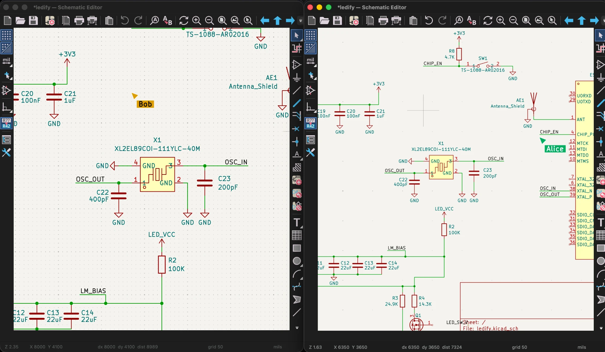
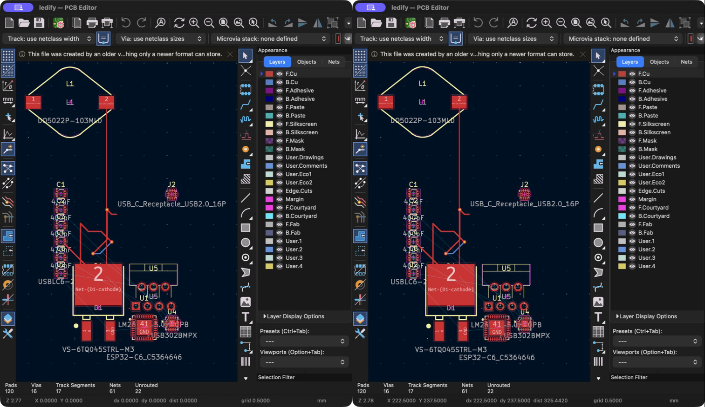
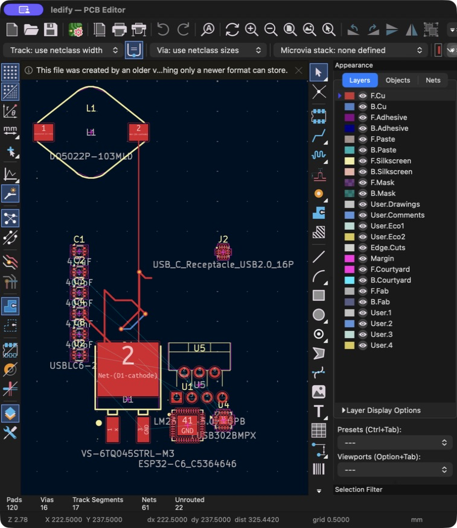

# KiCad Collaborative

**Design circuits together, live.** KiCad Collaborative brings multiplayer editing directly into KiCad’s schematic and PCB editors: shared cursors, live changes, cloud projects, and version history.

## Screenshots

Two schematic editors on the same sheet, each at its own zoom. The named cursor in each window is the other person's: Bob's editor (left) shows where Alice is working, and Alice's (right) shows Bob.

Two independent desktop clients connected to the same LEDify demo project. The image above combines screenshots of Alice’s and Bob’s editor windows.

| Alice’s PCB editor | Bob’s PCB editor |
| --- | --- |
|  |  |

## Features

- **Live schematic and PCB editing.** Share component moves, property changes, additions, deletions, wires, tracks, vias, text, and shapes.
- **Presence on the canvas.** Named, color-coded cursors and selections show where collaborators are working. Follow a peer’s viewport while reviewing a design.
- **In-progress previews.** See peers’ routing, wiring, and drag previews before they commit an edit.
- **Cloud projects.** Upload, browse, and open shared projects from the project manager; paired projects automatically rejoin their session.
- **Sharing and roles.** Invite collaborators by GitHub username or email, or create revocable editor/viewer links.
- **Comments and review.** Discuss the design through document comment threads and canvas pins.
- **Version history.** Create named checkpoints and restore an earlier version as the project owner.
- **Offline recovery.** Local edits are journalled and replayed after reconnection, with duplicate operations suppressed.
- **Libraries travel with your work.** Placed symbols and footprints are embedded in synchronization operations; project archives can include local libraries and 3D models.
- **Synchronized undo and redo.** Reverted edits are broadcast to collaborators. Undo is per-user and can overwrite newer changes to the same item.

## Try it

1. Open KiCad Collaborative and choose **File → Online Projects…** in the project manager.
2. Sign in with GitHub, then upload a project or open one shared with you.
3. Use **Share…** to invite a collaborator or create an editor/viewer link.
4. Open the same schematic or PCB in both clients. Cursors and supported edits synchronize live.

See [the collaboration guide](COLLABORATION.md) for supported operations and limitations, and [the server README](server/README.md) for self-hosting and protocol details.

## How it works

The native C++ editors send property-level changes over WebSocket to a Rust server backed by PostgreSQL. The server orders and durably stores operations before acknowledging and broadcasting them. Clients apply changes in that order; changes to the same property use last-writer-wins resolution. Presence is a separate, ephemeral channel.

This is a KiCad fork: collaboration overlays and edit hooks are built into the editors.

## Current limits

Board group/generator additions and edits, schematic sheet hierarchy changes, and schematic group membership are not fully synchronized. Remote zone outlines synchronize, but fills are rebuilt locally. The server currently supports one replica. See [known limitations](COLLABORATION.md#limitations) before using it for shared production work.

---

## Upstream KiCad

For specific documentation about [building KiCad](https://dev-docs.kicad.org/en/build/), policies
and guidelines, and source code documentation see the
[Developer Documentation](https://dev-docs.kicad.org) website.

You may also take a look into the [Wiki](https://gitlab.com/kicad/code/kicad/-/wikis/home),
the [contribution guide](https://dev-docs.kicad.org/en/contribute/).

For general information about KiCad and information about contributing to the documentation and
libraries, see our [Website](https://kicad.org/) and our [Forum](https://forum.kicad.info/).

## Build state

KiCad uses a host of CI resources.

GitLab CI pipeline status can be viewed for Linux and Windows builds of the latest commits.

## Release status

## Files
* [AUTHORS.txt](AUTHORS.txt) - The authors, contributors, document writers and translators list
* [CMakeLists.txt](CMakeLists.txt) - Main CMAKE build tool script
* [copyright.h](copyright.h) - A very short copy of the GNU General Public License to be included in new source files
* [Doxyfile](Doxyfile) - Doxygen config file for KiCad
* [INSTALL.txt](INSTALL.txt) - The release (binary) installation instructions
* [uncrustify.cfg](uncrustify.cfg) - Uncrustify config file for uncrustify sources formatting tool
* [_clang-format](_clang-format) - clang config file for clang-format sources formatting tool

## Subdirectories

* [3d-viewer](3d-viewer)         - Sourcecode of the 3D viewer
* [bitmap2component](bitmap2component)  - Sourcecode of the bitmap to PCB artwork converter
* [cmake](cmake)      - Modules for the CMAKE build tool
* [common](common)            - Sourcecode of the common library
* [cvpcb](cvpcb)             - Sourcecode of the CvPCB tool
* [demos](demos)             - Some demo examples
* [doxygen](doxygen)     - Configuration for generating pretty doxygen manual of the codebase
* [eeschema](eeschema)          - Sourcecode of the schematic editor
* [gerbview](gerbview)          - Sourcecode of the gerber viewer
* [include](include)           - Interfaces to the common library
* [kicad](kicad)             - Sourcecode of the project manager
* [libs](libs)           - Sourcecode of KiCad utilities (geometry and others)
* [pagelayout_editor](pagelayout_editor) - Sourcecode of the pagelayout editor
* [patches](patches)           - Collection of patches for external dependencies
* [pcbnew](pcbnew)           - Sourcecode of the printed circuit board editor
* [plugins](plugins)           - Sourcecode for the 3D viewer plugins
* [qa](qa)                - Unit testing framework for KiCad
* [resources](resources)         - Packaging resources such as bitmaps and operating system specific files
    - [bitmaps_png](resources/bitmaps_png)       - Menu and program icons
    - [project_template](resources/project_template)          - Project template
* [thirdparty](thirdparty)           - Sourcecode of external libraries used in KiCad but not written by the KiCad team
* [tools](tools)             - Helpers for developing, testing and building
* [translation](translation) - Translation data files (managed through [Weblate](https://hosted.weblate.org/projects/kicad/master-source/) for most languages)
* [utils](utils)             - Small utils for KiCad, e.g. IDF, STEP, and OGL tools and converters
